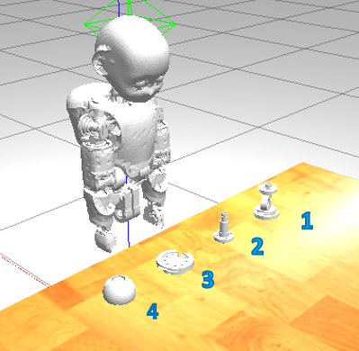

EPR Web Contest Sandbox
=======================

## ℹ Intro
Dear participants, after days of hard work 💪🏻 you reached the final frontier 🌌

To complete the crash course, we would like you to develop a demo to run both on the simulated and
physical robot that requires reusing all the components you have studied thus far, including CAD design,
YARP, PID Control, and Computer Vision.

You will be working in teams that will compete to win the first prize for the most awesome
and effective demo ✨

## 🎯 Objectives
1. Your team will be given specifications for CAD designing a particular object.
1. Put the mesh of the object in this [location](./gazebo/models/object), overwriting the existing `mesh.stl`.
1. Adjust the dimensions by fiddling with the parameters in the corresponding [`model.sdf`](./gazebo/models/object/model.sdf).
1. Your object will be part of a set of 4 objects in total that will be randomly presented to the robot as shown in the figure below.
1. Using your developers' abilities, analyze and expand the code in [`main.cpp`](./src/main.cpp) to let the iCub explore the world
   and detect where your specific object is located, that is whether in **position 1, 2, 3 or 4**.
1. Document your decisions, progress and solution within the repository.

<p align="center">
    
</p>

## ⚙ Testing your solution
You can test your code by launching the applications available in [`./app/scripts`](./app/scripts), or even better by
launching the script `./test.sh` in the [`./smoke-test`](./smoke-test) directory.

Bear in mind the following important aspects:
- The entry point to your code needs to be the request **`go`** sent to the RPC port `/service`, to which
  you are required to return the position of your object in the allowed set {1, 2, 3, 4}.
- The smoke-test will interrogate your module 3 times in a row by changing the scenario and you will have to
  respond to each request within **120 s** to prevent timeout from expiring.

### ☁ Instructions to run the sandbox on the web
1. This is a Gitpod-enabled sandbox, so to get started click on `https://gitpod.io/#https://github.com/easy-peasy-robotics/your-sandbox`

    

2. Once the sandbox workspace is ready, build and install the project:
    ```sh
    $ cd /workspace/web-contest-sandbox 
    $ mkdir build && cd build
    $ cmake ../
    $ make install
    ```
3. From within Gitpod, open up the browser at the port `6080` to get to the workspace desktop GUI.
4. In the desktop GUI, open a terminal and run the grasping experiment:
   ```sh
   $ cd /workspace/web-contest-sandbox/smoke-test
   $ ./test.sh
   ```

## 👥 Tips for team working
Optimize the resources by assigning teammates specific tasks so that some will design the object's mesh,
some other will deal with the motor control and others will be responsible for vision recognition.

Coordinating several developers working remotely certainly introduces overhead. To this end, leverage on
GitHub tools (issues, PR) and plan for intermediate milestones and frequent meetups to get everyone aligned
on the same page, gauge the progress and handle unexpected events.

Also, you may find the option for [sharing Gitpod workspaces](https://www.gitpod.io/docs/sharing-and-collaboration/#collaboration--sharing-of-workspaces)
quite useful in certain circumstances.

Remember not to rely on the appearance of fallback objects, as the physical setting where you
are going to put to test your object as well as the codebase will be different from the sandbox.

## 🏆 Evaluation Criteria
In descending priority order:
- How the 🤖 behaves overall (e.g. efficiency, stability, robustness, predictability).
- How the CAD design of the objest complies with the original requirements.
- How the repository is organized in terms of code and documentation.
- Possibly, mentors will [review your team's code](https://help.github.com/articles/about-pull-request-reviews).
